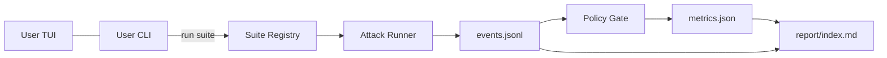
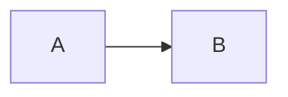

# RTAx
RTAx: a reproducible, privacy-first red-team agent for LLMs w/ suite registry, policy gating, and reporting. This repo publishes contracts and diagrams only.

# RTAx — LLM Red Teaming Agent (Public Overview)

> **Tagline:** A reproducible, privacy-first red-team agent for LLMs—suite registry, policy gating, and reporting. This repo publishes contracts and diagrams only.

[](LICENSE)


---

## TL;DR
- **What:** Modular framework to run curated adversarial suites against LLM systems, evaluate with a policy gate, and export human-readable safety reports.
- **Why:** Catch jailbreaks, prompt injection, and socio-technical risks early; standardize evidence without exposing sensitive internals.
- **How:** Contracts over internals — **Attacks** → **Gate/Eval** → **Report**. Internals are intentionally redacted.

> This public repo omits sensitive assets (prompt templates, provider configs, thresholds). See `docs/REDACTIONS.md` if present.





```markdown
# FILE: README_addon_how_diffs.md
## How RTAx differs from other red-team repos

- **Contracts over internals:** We publish stable artifact formats and interfaces so others can integrate without needing our private prompts or configs.
- **Privacy-first by design:** Redactions and scrubbing are part of the default workflow; reports are shareable without leaking secrets.
- **Suite registry + policy gate separation:** Attack definition, evaluation policy, and reporting are decoupled so teams can swap one layer without breaking the rest.
- **TUI/CLI parity:** A thin CLI is the source of truth; the TUI is just a front-end, making CI and local runs consistent.
- **Reproducible runs:** Lightweight run metadata (suite, model alias, seed, timestamps) enables repeatable testing without exposing provider details.


